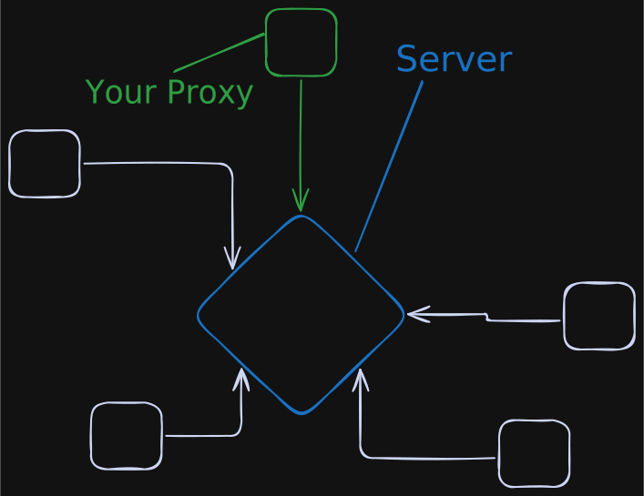
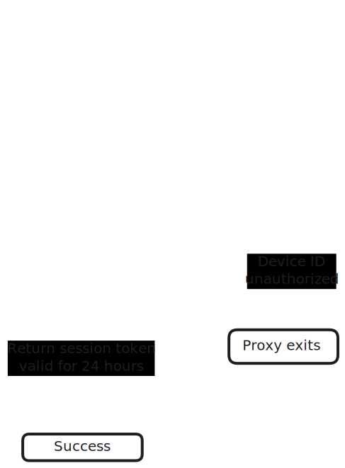
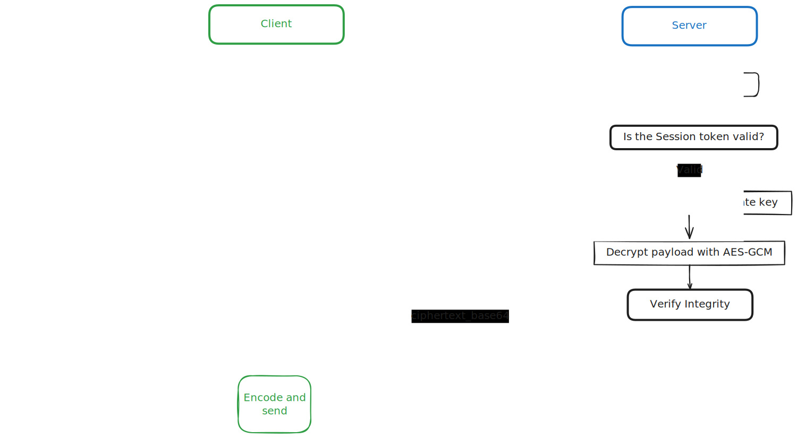

# pwoxy

Pwoxy isa proxy written in Rust to E2E-encrypt and forward the sabnzbd status to an external server.

## Prerequisites

- Rust 1.75+ (via [rustup](https://rustup.rs)
- OpenSSL (for generating RSA keys)

### Generate the Server RSA Key Pair

Generate the private key for the server and the public key for all proxies. You only need to do this once and can reuse the public key

```bash
openssl genrsa -out server_private.pem 4096
openssl rsa -in server_private.pem -pubout -out server_public.pem
```

### Add a device ID

You need to register a device ID in order to send data to the server.
Add a new device on your server and paste the device ID in config.toml

### or

### Turn off authentication (not recommended)

Add NOAUTH=true to your env if using the official server otherwise make the server not check device/session id's and return an empty string as the session token on handshake.
> **WARNING**: Anyone with your public key can send data to your server (so prob don't use this in prod or anything that you care about)

### Update your config

Copy the sample configuration and update the values:

   ```bash
   cp config.example.toml config.toml
   ```

Set `interval_seconds` to your desired interval (default: 30 seconds).
Point `sab_url` at your SABnzbd API endpoint (usually `http://127.0.0.1:8080/api` if running locally) and add your api key as `sab_apikey`.
Add the base api url of your server (relative to /handshake and /status) and add your device id.
Paste the entire public key (including the header/footer) into `public_key`.

Example:

```toml
interval_seconds = 30
sab_url = "http://127.0.0.1:8080/api"
sab_apikey = "cpsnrz8ybjqgkm9l56u9q91dxvn4p04qh8vxwj"
server_url = "https://localhost:3000/api/"
device_id = "DEVICE_ID_FROM_SERVER"
public_key = """
-----BEGIN PUBLIC KEY-----
key data here
-----END PUBLIC KEY-----
"""
```

### Run the Proxy

From the repository root:

```bash
make run
```

Or:

```bash
cargo run --release -- --config config.toml
```

If you need additional logs, set `RUST_LOG` to `debug`

```bash
RUST_LOG=debug cargo run -- --config config.toml
```

## How it works



### Handshake



### Communication


